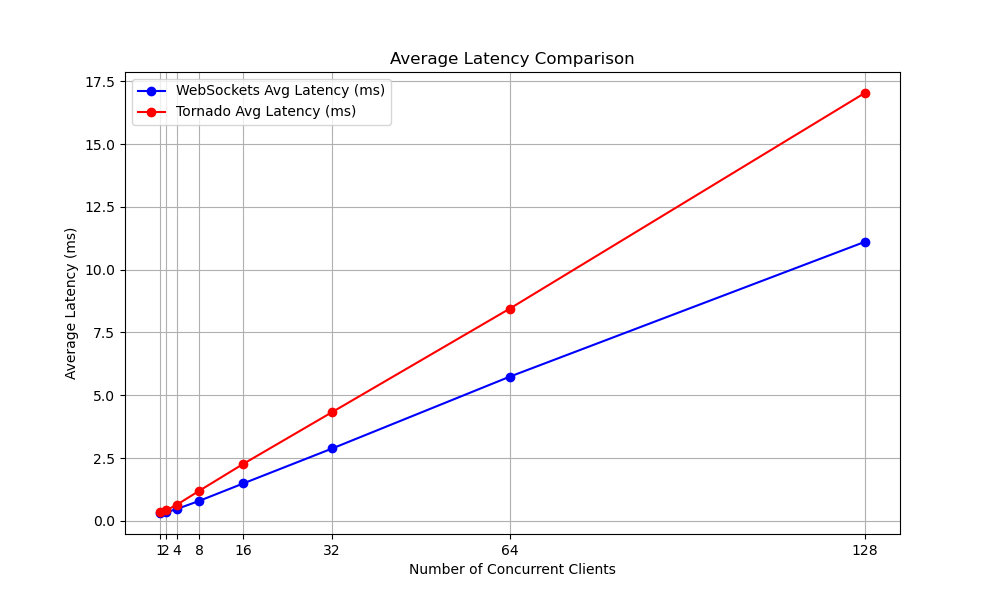
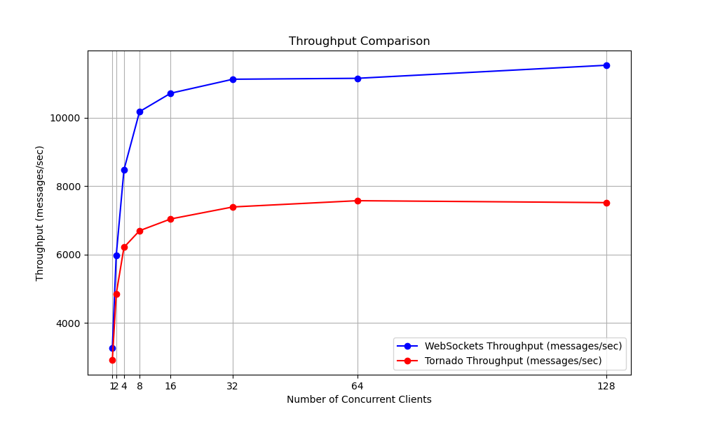
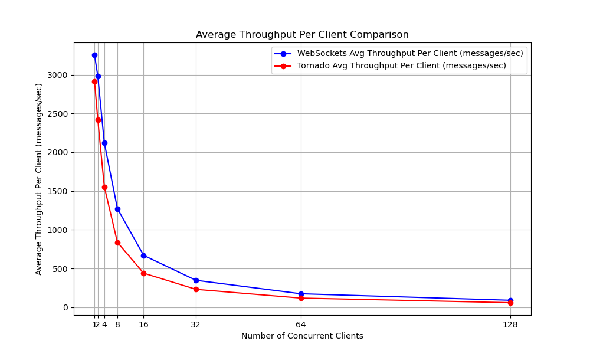

# Websockets Comparison  

Purpose of this benchmark is to compare the throughput, latency(round-trip time) and scalability of the websocket server/client implementations of a Websockets and Tornado libraries. The choice of these libraries was driven by specific considerations. Websockets is one of the most widely used Python libraries for handling WebSocket connections, which is obvious from its name. As for Tornado, despite the presence of other potentially higher-performing options, it was selected because it has been tested much.

In order to do this comparison, I/O bound setting is utilized where client sends data to an echo server and waits for the response. Client behavior is kept same between 2 implementations. Test are conducted using different number of concurrent clients. Test durations were 10 seconds after the establishment of the connection.

## Test Environment

Operating System: macOS Ventura 13.6  
Memory: 16 GB  
CPU: Apple M1 Chip ( 8 core )  
Threads used: 1  
Data type: String (108 bytes)

Note on data type selection: At first, binary data type that is also used on ITCH protocol is selected but it turned out that Tornado server is problematic with binary data. Therefore, string representation of binary data is used.

## Results - Comparison

### Latency

Average latencies of the results shows that both WebSocket and Tornado experience increased latency as the number of concurrent clients grows. This increase seems to be linear, which is expected since we are trying to do more operations with the same resources.

When two libraries are compared, Websockets have less latency at all client numbers. But both are problematic as number of concurrent clients increases.

### Throughput

When we examine throughputs, decreasing returns to scale is observed as number of concurrent client increases. This is expected since we are running concurrent connections with the same resources.

What is not expected is that Tornado falls considerably behind the Websockets. While both exhibits decreasing returns to number of concurrent clients and reach a plateue at similar points, Tornado, always falls below the Websockets and this difference increases as the number of clients increases. This shows that websockets is better in asynchronously handling concurrent operations.

In conclusion, Websockets library seems to be winner of this comparison. It was not only better in one client and its performance decline in concurrent connections were slower than the Tornado. Websockets seems to manage concurrent clients up to 8 fairly good. Despite decrease in average throughput per client is considerably high, increase in total throughput per second is still high enough up to 8 clients. Of course, this will depend on the needs on the specific project since there is also increased latency factor with number of clients going up.

Below tables with all the results data and a list of useful links are provided below for those interested:

## Websockets Data

| Number of Clients | Total Messages | Average Latency (ms) | Min Latency (ms) | Max Latency (ms) | Throughput (messages/sec) | Average Throughput per Client (messages/sec) |
| ----------------- | -------------- | -------------------- | ---------------- | ---------------- | ------------------------- | -------------------------------------------- |
| 1                 | 32553          | 0.31                 | 0.26             | 0.97             | 3255.30                   | 3255.30                                      |
| 2                 | 59665          | 0.33                 | 0.29             | 18.38            | 5966.50                   | 2983.25                                      |
| 4                 | 84790          | 0.47                 | 0.39             | 1.35             | 8479.00                   | 2119.75                                      |
| 8                 | 101746         | 0.79                 | 0.67             | 1.99             | 10174.60                  | 1271.83                                      |
| 16                | 107125         | 1.49                 | 1.23             | 3.83             | 10712.50                  | 669.53                                       |
| 32                | 111217         | 2.88                 | 1.88             | 8.94             | 11121.70                  | 347.55                                       |
| 64                | 111486         | 5.74                 | 3.57             | 14.77            | 11148.60                  | 174.20                                       |
| 128               | 115302         | 11.11                | 5.41             | 29.45            | 11530.20                  | 90.08                                        |

## Tornado Data

| Number of Clients | Total Messages | Average Latency (ms) | Min Latency (ms) | Max Latency (ms) | Throughput (messages/sec) | Average Throughput per Client (messages/sec) |
| ----------------- | -------------- | -------------------- | ---------------- | ---------------- | ------------------------- | -------------------------------------------- |
| 1                 | 29160          | 0.34                 | 0.28             | 4.87             | 2916.00                   | 2916.00                                      |
| 2                 | 48432          | 0.41                 | 0.29             | 5.50             | 4843.20                   | 2421.60                                      |
| 4                 | 62098          | 0.64                 | 0.32             | 4.90             | 6209.80                   | 1552.45                                      |
| 8                 | 66939          | 1.19                 | 0.48             | 7.17             | 6693.90                   | 836.74                                       |
| 16                | 70373          | 2.27                 | 1.02             | 7.45             | 7037.30                   | 439.83                                       |
| 32                | 73886          | 4.33                 | 2.06             | 13.98            | 7388.60                   | 230.89                                       |
| 64                | 75712          | 8.45                 | 0.36             | 23.50            | 7571.20                   | 118.30                                       |
| 128               | 75150          | 17.04                | 1.04             | 39.10            | 7515.00                   | 58.71                                        |

## Useful Links
[Awesome Websockets Repository](https://github.com/facundofarias/awesome-websockets)

[WebSocket Performance Comparison](https://matttomasetti.medium.com/websocket-performance-comparison-10dc89367055)

[Python is slow? Wait, it's actually fast!](https://ville-karkkainen.medium.com/python-is-slow-wait-its-actually-fast-6d2e49621b1)

